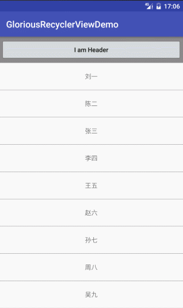
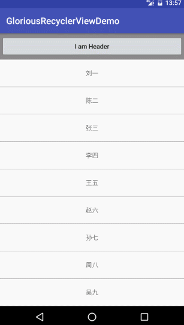

# GloriousRecyclerView

A full function RecyclerView integration of Header, Footer,EmptyView and Pull Up To Load More

### Usage

Step 1.  Add the dependency
```
dependencies {
    compile 'com.xpc:gloriousrecyclerview:0.2.0'
}
```

Step 2.  Add the in xml

```xml
<com.xpc.gloriousrecyclerview.GloriousRecyclerView
    android:id="@+id/recycler_view"
    android:layout_width="match_parent"
    android:layout_height="match_parent"/>
```

or

```xml
<com.xpc.gloriousrecyclerview.GloriousRecyclerView
    android:id="@+id/recycler_view"
    android:layout_width="match_parent"
    android:layout_height="match_parent"
    app:hideNoMoreData="true"
    app:loadMoreTextColor="#0080ff"
    app:loadMoreTextSize="14sp"
    app:loadMoreBackground="#ccc"
    app:loadMoreIndeterminateDrawable="@drawable/loading_icon_drawable"/>
```

> `hideNoMoreData`: Hide the LoadMoreView When no more data, default is `true`

> `loadMoreIndeterminateDrawable`: The ProgressBar Indeterminate Drawable of LoadMoreView

Step 3.  The code in Activity, see [Demo](./app/src/main/java/com/xpc/gloriousrecyclerviewdemo/GloriousActivity.java)

---
### Feature

* addHeaderView
* addFooterView
* setEmptyView
* setLoadMoreListener


`public void addHeaderView(android.view.View view)`

Add the GloriousRecyclerView footerView 

`public void addFooterView(android.view.View view)`

Add the GloriousRecyclerView footerView

`public void setEmptyView(android.view.View view)`

Add the GloriousRecyclerView emptyView

`public void setLoadMoreListener(GloriousRecyclerView.AutoLoadMoreListener loadMoreListener)`

Listen the GloriousRecyclerView scrolled to the end and will trigger loadMoreListener.onLoadMore()

Called this also means that loadMore enabled, the list bottom will add a loadMoreView
 
`public void notifyLoadMoreSuccessful(boolean hasMore)`

If you have ever called setLoadMoreListener, when load data successful, call this to to notify the loadMoreView change UI state

boolean hasMore: Whether has more data to be loaded

`public void notifyLoadMoreFailed()`

If you have ever called setLoadMoreListener, when load data failed, call this to to notify the loadMoreView change UI state

---
### Effect Picture





